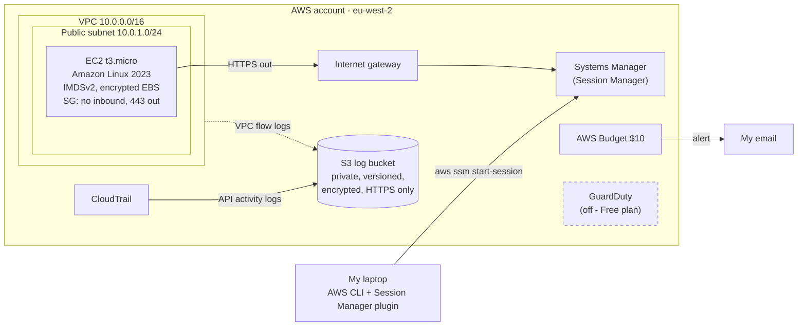
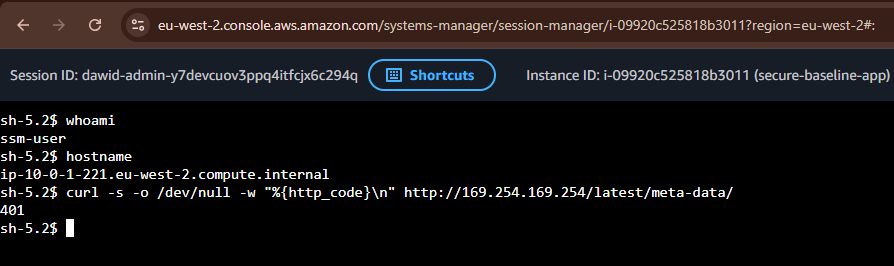
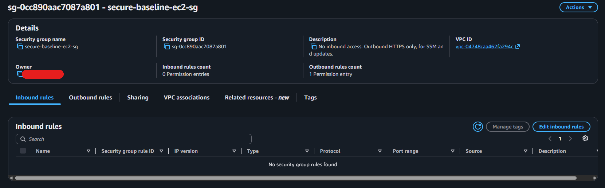
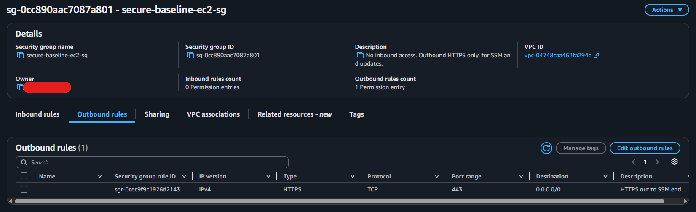
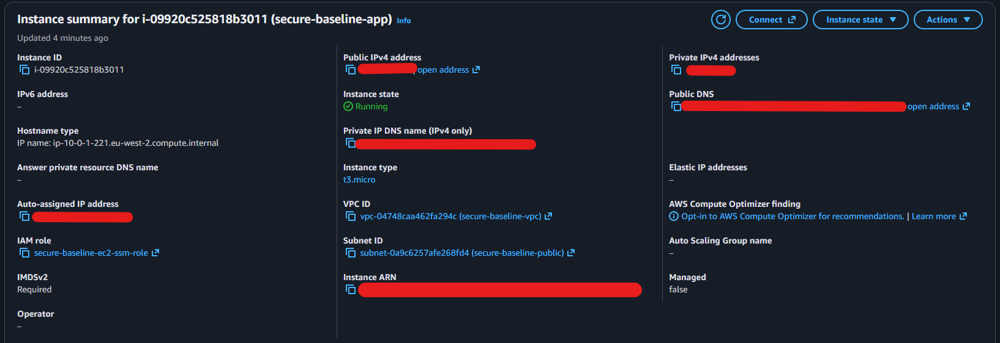
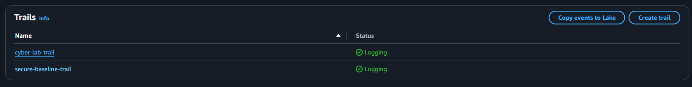
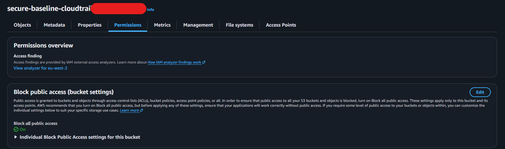
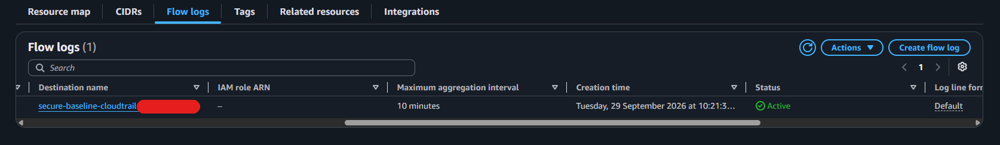
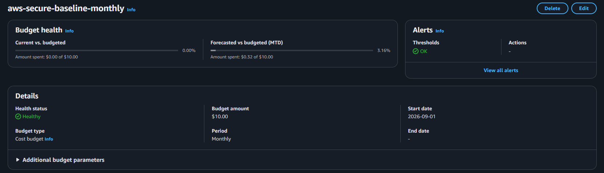
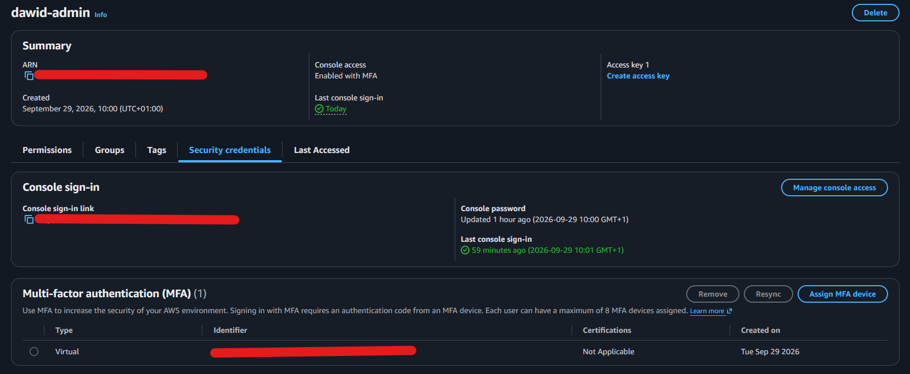

# aws-secure-baseline

This is my first Terraform project and my first proper go at building something in AWS.

Some background: I'm a security engineer and most of my day is spent in Microsoft 365 and Azure (Entra ID, Defender, Intune, Conditional Access, that kind of thing). I wanted to learn AWS and Terraform properly, and I learn best by building something small and then trying to break it or find what's wrong with it. So this is a small AWS setup with a few security basics, built with Terraform, with Checkov in a pipeline telling me what I got wrong.

It is not a production setup and I'm not an AWS expert. It's a learning project, and I've tried to be honest below about what it does and doesn't cover.

## What it builds

- **Budget** - $10/month budget that emails me at 80% actual spend and 100% forecasted spend. First thing I built.
- **Network** - a VPC with one public subnet, an internet gateway and a route table. The VPC's default security group is taken over by Terraform and has all its rules removed.
- **VPC flow logs** - all traffic in the VPC is logged to S3.
- **EC2 instance** - one t3.micro running Amazon Linux 2023:
  - no SSH key pair, and the security group has **no inbound rules**
  - I connect with **SSM Session Manager** using an IAM role with `AmazonSSMManagedInstanceCore`
  - IMDSv2 required, encrypted root volume, outbound traffic limited to HTTPS
- **S3 log bucket** - public access blocked, versioning on, default encryption, a lifecycle rule, and a bucket policy that denies anything not over HTTPS.
- **CloudTrail** - a trail in eu-west-2 writing to the bucket, with log file validation turned on.
- **GuardDuty** - written in the code but **turned off**, see below.
- **GitHub Actions** - runs `terraform fmt`, `validate`, `tflint` and `checkov` on every pull request. It doesn't need or have any AWS credentials.

Everything is tagged `Project = aws-secure-baseline`.

### About GuardDuty

My AWS account is on the new AWS Free plan and it turns out GuardDuty isn't available on it. The API just returns `SubscriptionRequiredException` (see [docs/evidence/08-guardduty.txt](docs/evidence/08-guardduty.txt)). The resource is still in [main.tf](main.tf) behind a variable `enable_guardduty` which defaults to `false`. On an account with a paid plan you'd set it to `true`.

## Architecture



## Files

| File | What's in it |
|---|---|
| [versions.tf](versions.tf) | Terraform and AWS provider versions, provider config, default tags |
| [variables.tf](variables.tf) | Region, profile, budget email/limit, GuardDuty switch |
| [main.tf](main.tf) | Budget and GuardDuty |
| [network.tf](network.tf) | VPC, subnet, internet gateway, route table, default SG, flow logs |
| [compute.tf](compute.tf) | AMI lookup, IAM role and instance profile, security group, EC2 instance |
| [logging.tf](logging.tf) | S3 bucket and its settings, bucket policy, CloudTrail |
| [outputs.tf](outputs.tf) | Instance ID, VPC ID, bucket and trail names |
| [.github/workflows/terraform-checks.yml](.github/workflows/terraform-checks.yml) | PR checks |
| [docs/evidence/](docs/evidence/) | Command output I saved after deploying |

It's one root module with flat files and local state. I kept it simple on purpose so I actually understand every line.

## How to run it

You need Terraform (>= 1.9), AWS CLI v2 and the [Session Manager plugin](https://docs.aws.amazon.com/systems-manager/latest/userguide/session-manager-working-with-install-plugin.html). Don't use the root user - I created an IAM user for this.

```bash
# log in (opens a browser) and check who you are
aws login --profile portfolio --region eu-west-2
aws sts get-caller-identity --profile portfolio

# put your email in terraform.tfvars (this file is gitignored)
cp terraform.tfvars.example terraform.tfvars

terraform init
terraform plan -out=tfplan
terraform apply tfplan

# connect to the instance - no SSH, no open ports
aws ssm start-session --profile portfolio --target $(terraform output -raw instance_id)
```

The instance can show as "Online" in Systems Manager a minute or two before Session Manager actually lets you connect. I got `TargetNotConnected` a few times at first and it just needed a bit longer.

## Checkov: before and after

I wrote the first version without a few things on purpose (no IMDSv2, no EBS encryption, no S3 encryption, egress open to everything) and opened a PR to see what Checkov would catch. The pipeline failed as expected.

| | Passed | Failed | Skipped |
|---|---|---|---|
| First PR run ([output](docs/evidence/checkov-before.txt)) | 31 | 20 | 0 |
| After fixes ([output](docs/evidence/checkov-after.txt)) | 41 | 0 | 11 |

Each fix is its own commit in [PR #1](https://github.com/DawidTrochim/aws-secure-baseline/pull/1):

| Check | Fix |
|---|---|
| CKV_AWS_79 | Require IMDSv2 on the instance |
| CKV_AWS_8 | Encrypt the EBS root volume |
| CKV_AWS_36 | Turn on CloudTrail log file validation |
| CKV_AWS_23, CKV_AWS_382 | Limit SG egress to 443 and add a description to the rule |
| CKV_AWS_135 | Set `ebs_optimized` (free on t3) |
| CKV2_AWS_12 | Remove all rules from the VPC's default security group |
| CKV2_AWS_61 | Lifecycle rule on the log bucket |
| CKV2_AWS_11 | VPC flow logs to S3 |

I also set default SSE-S3 encryption on the bucket (Checkov still flags it because it wants a KMS key, see below), added a bucket policy statement that denies non-HTTPS requests, and set the instance to `standard` CPU credits so a busy CPU can't add charges.

The 11 skipped checks are the ones where the fix costs money or needs more infrastructure than makes sense here. Each one has a `#checkov:skip` comment in the code with the reason:

| Check | Why I skipped it |
|---|---|
| CKV_AWS_35, CKV_AWS_145 | KMS customer managed key - about $1/month plus key policy work. Using SSE-S3 for now. |
| CKV_AWS_130 | Subnet gives public IPs - needed to reach SSM without a NAT gateway or VPC endpoints. No inbound rules though. |
| CKV_AWS_67 | Trail is single-region on purpose. The account already has a separate multi-region trail. |
| CKV2_AWS_10 | CloudTrail to CloudWatch Logs - extra cost, planned next. |
| CKV_AWS_252 | SNS topic for CloudTrail - nothing would use it. |
| CKV_AWS_126 | Detailed monitoring - costs extra per metric. |
| CKV_AWS_18 | S3 access logging - needs a second bucket. |
| CKV_AWS_144 | Cross-region replication - second bucket and double the storage. |
| CKV2_AWS_62 | S3 event notifications - nothing consumes them. |
| CKV2_AWS_3 | GuardDuty org config - this is a single account, no AWS Organization. |

## Controls mapped to CIS AWS Foundations Benchmark

My own mapping against CIS AWS Foundations Benchmark v3.0.0. I've tried to be honest about what's only partly done. Evidence is in [docs/evidence/](docs/evidence/).

| CIS ID | Control | Status | How / evidence |
|---|---|---|---|
| 1.7 | Don't use the root user for day to day tasks | Met | Terraform runs as an IAM user ([01](docs/evidence/01-caller-identity.txt)) |
| 1.10 | MFA for IAM users with console access | Met | MFA device on my IAM user, credential report shows `mfa_active = true` ([10](docs/evidence/10-iam-mfa.txt)). I added it after the first deploy, so the CloudTrail event in [05](docs/evidence/05-cloudtrail.txt) still shows `mfaAuthenticated: false`. |
| 2.1.1 | S3 bucket policy denies HTTP requests | Met | `DenyInsecureTransport` statement ([07](docs/evidence/07-s3-bucket.txt)) |
| 2.1.4 | S3 Block Public Access | Met | All four settings on ([07](docs/evidence/07-s3-bucket.txt)) |
| 2.2.1 | EBS encryption | Partial | Root volume is encrypted, but I haven't turned on account-level EBS default encryption ([04](docs/evidence/04-instance-hardening.txt)) |
| 3.1 | CloudTrail enabled in all regions | Partial | My trail is single-region; the account has another multi-region trail ([05](docs/evidence/05-cloudtrail.txt)) |
| 3.2 | CloudTrail log file validation | Met | `enable_log_file_validation = true` ([05](docs/evidence/05-cloudtrail.txt)) |
| 3.5 | CloudTrail logs encrypted with KMS CMK | Not met | Using SSE-S3 - skipped for cost |
| 3.7 | VPC flow logs enabled | Met | Flow log active, delivering to S3 ([06](docs/evidence/06-vpc-flow-logs.txt)) |
| 5.2 | No SG allows 0.0.0.0/0 to admin ports | Met | No inbound rules at all ([04](docs/evidence/04-instance-hardening.txt)) |
| 5.4 | Default security group restricts all traffic | Met | No rules on the default SG ([04](docs/evidence/04-instance-hardening.txt)) |
| 5.6 | EC2 metadata service only allows IMDSv2 | Met | `http_tokens = "required"`, v1 request returns 401 ([03](docs/evidence/03-session-manager.txt)) |

## Evidence

After `terraform apply` I checked everything actually worked and saved the output. The account ID, my email and my IP are replaced. There are also [screenshots](#screenshots) from the console further down.

- [01-caller-identity.txt](docs/evidence/01-caller-identity.txt) - running as an IAM user, not root
- [02-terraform-apply.txt](docs/evidence/02-terraform-apply.txt) - apply output, 20 resources
- [03-session-manager.txt](docs/evidence/03-session-manager.txt) - Session Manager session, IMDSv1 refused (401), IMDSv2 works (200)
- [04-instance-hardening.txt](docs/evidence/04-instance-hardening.txt) - IMDSv2, encrypted volume, no key pair, no inbound rules, standard credits
- [05-cloudtrail.txt](docs/evidence/05-cloudtrail.txt) - trail logging, files arriving in S3, and my own Session Manager login found in the logs
- [06-vpc-flow-logs.txt](docs/evidence/06-vpc-flow-logs.txt) - flow log active
- [07-s3-bucket.txt](docs/evidence/07-s3-bucket.txt) - public access block, versioning, encryption, HTTP request denied
- [08-guardduty.txt](docs/evidence/08-guardduty.txt) - why GuardDuty isn't on
- [09-budget.txt](docs/evidence/09-budget.txt) - budget and alert thresholds
- [10-iam-mfa.txt](docs/evidence/10-iam-mfa.txt) - MFA on my IAM user (added after the first deploy)

## Screenshots

Taken from the console while it was deployed. Account ID, IPs and similar details are covered in red.

**Session Manager** - shell on the instance with no SSH key and no open ports. The last command is a plain IMDSv1 request, which gets `401` because IMDSv2 is required.



**Security group** - no inbound rules at all, and one outbound rule for HTTPS.





**Instance** - IMDSv2 required, the SSM role attached, no key pair.



**CloudTrail** - my trail logging (the other one is the account's existing multi-region trail).



**S3 log bucket** - Block all public access on.



**VPC flow logs** - active, delivering to the log bucket.



**Budget** - $10 monthly budget. It shows $0.00 spent because the account's credits cover it (see [Cost](#cost)).



**IAM user** - console access enabled with MFA.



## What I learned

- **IAM roles for EC2 feel a lot like managed identities in Azure.** The instance gets short-lived credentials through the metadata service and there's no secret to store. What I didn't appreciate before is how much that makes the metadata service a target, which is why IMDSv2 matters. An SSRF bug in an app can call IMDSv1 with a plain GET and get the role's credentials. With v2 you need a PUT to get a token first, and the hop limit of 1 stops it being reached from a container.
- **Session Manager replaced SSH completely.** No key pair, no port 22, no bastion. It's similar in spirit to Azure Bastion but you don't pay for a bastion host. Every session start shows up in CloudTrail with who started it and on which instance, which I checked ([05](docs/evidence/05-cloudtrail.txt)). It doesn't record what you type in an interactive session though - for that you'd need Session Manager's own session logging.
- **Security groups aren't NSGs.** They're stateful, there are no deny rules, and every VPC comes with a default SG that allows all traffic between its members. I didn't know that until Checkov flagged it.
- **Checkov is noisy, but in a useful way.** Some findings were a one-line fix, some would cost money every month. I found writing the reason next to each skip made me think about whether it really mattered.
- **Service principals need bucket policies.** CloudTrail and VPC flow logs both need to be allowed to write to the bucket, and adding `aws:SourceArn` / `aws:SourceAccount` conditions means another account can't use my bucket.
- **Test what you think you're testing.** My first check of the HTTPS-only policy was an anonymous `curl` over HTTP, which returned 403. But an anonymous request gets 403 anyway because the bucket isn't public, so it proved nothing. The proper test was a signed request as my own admin user over HTTP, which gets an explicit deny from the bucket policy.
- **Terraform basics.** `plan` before `apply` every time, the state file has resource details in it and shouldn't be committed, and `force_destroy` on a bucket is handy for a lab but not something I'd want on real logs.
- **Read the account's limits.** The AWS Free plan doesn't include GuardDuty, which I only found when the API call failed.

## Cost

Rough numbers for eu-west-2 (London):

| Item | Approx. cost |
|---|---|
| t3.micro | ~$0.012/hour |
| Public IPv4 address | $0.005/hour |
| 8 GB gp3 EBS | ~$0.75/month |
| CloudTrail | First trail of management events is free. This account already has one, so this trail is billed at $2 per 100,000 events, which is cents in a quiet account |
| VPC flow logs to S3, S3 storage | Cents |
| Budget | Free (no budget actions used) |

Leaving it running for a week is about $3. A full month would be about $13, which is over the budget. I deploy it, check it, and tear it down.

One thing I noticed afterwards: AWS budgets count spend **after credits** by default. My account has Free plan credits, so while they last the budget sees roughly $0 and the alert wouldn't fire. Setting `include_credit = false` in a `cost_types` block would make it track the real spend. That's on the next steps list.

## Teardown

```bash
terraform destroy
```

The S3 bucket has `force_destroy = true` so it gets deleted even with logs in it. After destroying, I check nothing is left:

```bash
aws ec2 describe-instances --profile portfolio --filters Name=tag:Project,Values=aws-secure-baseline --query "Reservations[].Instances[].State.Name"
aws cloudtrail describe-trails --profile portfolio --trail-name-list secure-baseline-trail
aws s3 ls --profile portfolio | grep secure-baseline
```

## Next steps

- Make the budget ignore credits (`include_credit = false`) so the alert tracks real spend
- Move to IAM Identity Center instead of IAM users
- Customer managed KMS key for the bucket and CloudTrail
- Multi-region trail, send it to CloudWatch Logs and add the CIS section 4 metric filters and alarms (root login, console login without MFA, IAM policy changes, etc.)
- Turn on GuardDuty once the account is on a paid plan
- Turn on EBS encryption by default for the account, and AWS Config
- VPC endpoints for SSM so the instance doesn't need a public IP
- Remote state in S3 with locking, and GitHub Actions running `terraform plan` using OIDC instead of stored keys
